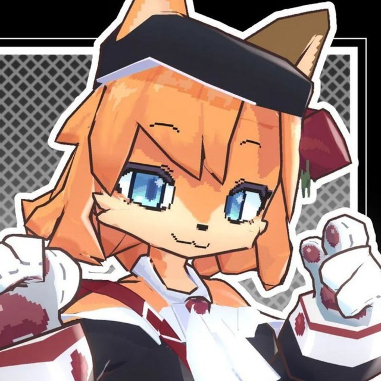

<!DOCTYPE html>
<html lang="ru">
<head>
    <meta charset="UTF-8">
    <meta name="viewport" content="width=device-width, initial-scale=1.0">
    <title>Tocik Studio</title>
    <link rel="stylesheet" href="styles.css"> <!-- Подключаем CSS -->
    <!-- Подключаем шрифт Roboto -->
    <link href="https://fonts.googleapis.com/css2?family=Roboto:wght@400;500;700&display=swap" rel="stylesheet">
    <!-- Иконочный шрифт для соцсетей -->
    <link rel="stylesheet" href="https://cdnjs.cloudflare.com/ajax/libs/font-awesome/6.0.0/css/all.min.css">
</head>
<body>
    <!-- Шапка -->
    <header>
        

            
Tocik Studio

            <nav class="nav-links">
                <a href="#main">Главная</a>
                <a href="#news">Новости</a>
                <a href="#games">Игры</a>
            </nav>
            <a href="https://itch.io" class="nav-links">Itch.io</a>
        

    </header>

    <!-- Главная секция -->
    <section class="hero" id="main">
        

            <h1>Tocik Studio</h1>
            
Мы создаем уникальные пиксель-арт игры с душой и вниманием к деталям. Погрузитесь в наши миры и откройте для себя магию ретро-стиля!

        

    </section>

    <!-- Секция новостей -->
    <section class="container" id="news">
        

            

                
                

                    <h2>Главная новость</h2>
                    
Текст основной новости...

                

            

            

                

                    
                    

                        <h3>Новость 1</h3>
                        
Краткое описание...

                    

                

                

                    
                    

                        <h3>Новость 2</h3>
                        
Краткое описание...

                    

                

                

                    
                    

                        <h3>Новость 3</h3>
                        
Краткое описание...

                    

                

            

        

        <a href="#" class="view-all-btn">Смотреть все</a>
    </section>

    <!-- Секция игр -->
    <section class="container" id="games">
        

            

                
                <h3>Compilation</h3>
                
Атмосферна гра про цифрову реальність, де ти досліджуєш унікальний віртуальний світ і розкриваєш його таємниці.

                <a href="#">Посилання</a>
            

            <!-- Добавьте больше игр по аналогии -->
        

    </section>

    <!-- Футер -->
    <footer>
        

            

                <a href="#"><i class="fab fa-twitter"></i></a>
                <a href="#"><i class="fab fa-discord"></i></a>
                <a href="#"><i class="fab fa-youtube"></i></a>
            

            <nav class="nav-links" style="margin-top: 1rem;">
                <a href="#main">Главная</a>
                <a href="#news">Новости</a>
                <a href="#games">Игры</a>
            </nav>
        

    </footer>
</body>
</html>
